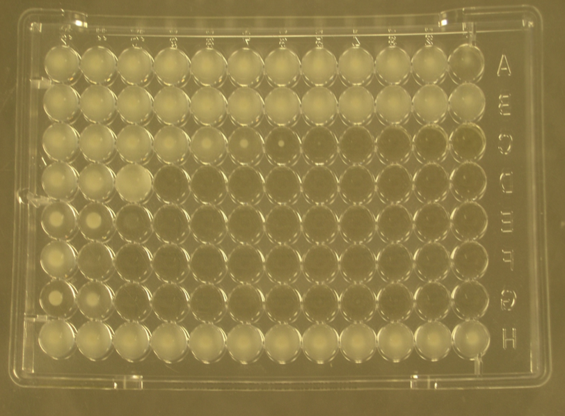
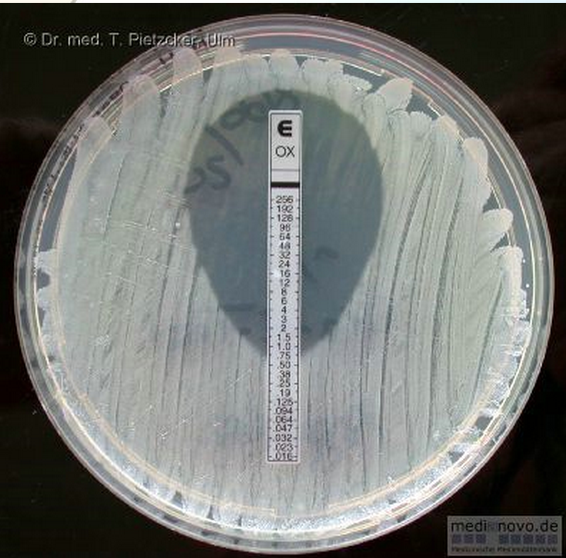
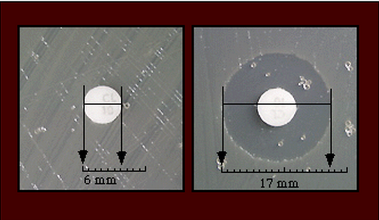
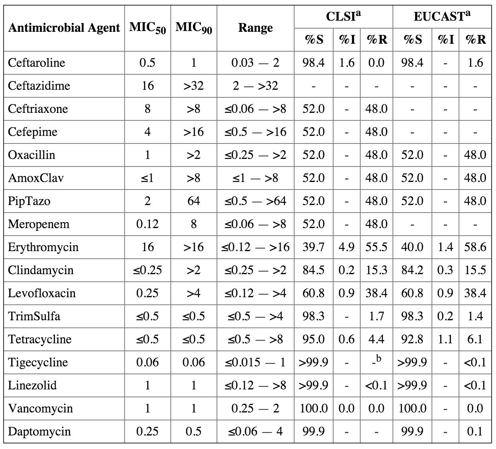

# Existing Code Write Up

**ToDo**
- [x] Overview of MIC, testing and results.
- [x] Identify (filter) which isolates should be included in this execution
- [ ] Demonstrate how the generated sql enforces those filters for attributes that come from each of the possible tables:  isolates, organisms, sites, isolate_attributes:
  * (validated\_mic_results can be used in filters as well but hold off on that)
- [ ] Document how the drug/mic/edge/count that comes back are stored into `frequency_distribution.rb`, and then how they are normalized in different cases (2 lows, 2 highs) in instances of `frequency_distribution.rb`
- [ ] Document how the `isolate_drug_reactions` data fields:
  * authority
  * publication
  * delivery_mechanism
  * infection_type
  * interpretation
  * eligible_interpretations
  * footnotes
  are queried for and stored in `drug_reaction_set.rb`
- [ ] Adapt the `fd_to_csv` / `fd_to_csv_debug methods` to serialize all frequency\_distribution instances returned by an isolate_filter instance into a single nested json/hash structure that contains all known data

## Minimum Inhibitory Concentration 

In microbiology, **Minimum Inhibitory Concentration (MIC)** is the lowest concentration of an antimicrobial that will inhibit the visible growth of a microorganism after overnight incubation. At **JMI Labs**, we several different kinds of tests to identify the MIC for a particular drug and organism combination. These tests include:

  * **MIC Panel** 
  	 <br />
  	 
  * **E-Test** 
    <br />
  	 
  * **Agar Dilution** 
    <br />
  	 
  * **Disk Diffusion** 
    <br />
  	 

In order to perform this testing, **JMI Labs** works with hospitals around the world to get many different samples of an organism, these are called isolates. Within our labs, we have tens of thousands of different organisms each with unique properties. 

We use this wide range of isolates to provide our clients with a normalized frequency distribution of all MIC results for a particular drug / organism combination. Such results look similar to the following table:

* Todo Add description of breakpoints and authorities

 

## Step 1: Determine which isolates to include in the report

Isolates can be filtered and grouped by any combination of the following attributes:

```
# :isolate_id
# :isolate_number
# :validation_status_code
# :bank_number
# :continent
# :country
# :genus
# :gram
# :level_1
# :level_2
# :level_3
# :level_4
# :master_group
# :objective
# :organism_code
# :organism
# :organism_group
# :viridans_group
# :site
# :species
# :us_census_region
# :year
# :category_value
# :client_category_value # for using direct published client data sets
# :client_infection_type # for using direct published client data sets
# :client_program_code # for using direct published client data sets
# :reacts_like_to
# [
#   {
#     authority: 'CLSI',
#     publication: '2015',
#     delivery_mechanism: '',
#     infection_type: '',
#     drug: 'Oxacillin',
#     interpretations: %w( NS I R )
#   }
# ]
# :dilutions_differ_by
# [
#   drug_1: "Imipenem",
#   drug_2: "ImipenemSENTRY",
#   allowed_difference: 2
#   operator: :at_most, :at_least
# ]
# :drug_dilution_criteria
# becomes AND of all conditions
# [
#   {
#     drug: "Imipenem",
#     comparator: :gte | :gt | :lte | :lt | :eq
#     dilution: 32
#   },
#   {
#     drug: "Meropenem",
#     comparator: :gte | :gt | :lte | :lt | :eq
#     dilution: 16
#   }
# ]
# :run_number
# :position_in_run
# :panel_name
# :panel_lot
# :read_date
# :reader_name
```
Each of the attributes are passed in as the value of either an `:include` or `:exclude` keyed hash.

_Examples_

```
year: { include: [ 2014 ] },
organism_code: { include: %w( SA ) },
organism_code: { excule: %w( SH ) },
client_category_value: { include: 'MSSA' },
...
```


### Create the filter

To identify the isolates based on the unique combination of attributes we need to instantiate a new IsolateFilter:

```
isolate_filter = IsolateFilter.new(name: "Example")
```

Next we have to set the database _prefix_ to select which dataset we should use in the analysis:

```
isolate_filter.setTablePrefix( 'example_' )
```

### Add attributes and values to the filter

Adding filter criteria to the isolate filter is easy

```
isolate_filter.setAttributeFilter(attribute_name: { [include|exclude]: filter_value })
```

_Example_

```
isolate_filter.setAttributeFilter( year: { include: [ 2014 ] } )
```

### Calculate Frequency Distributions

In order to calculate the frequency distribution of MIC results for all isolates matched by the `isolate_filter`, we need to indicate which 
drugs and breakpoint authorities to include in the analysis:

_Primary Drug Example_

```
primary_drugs = [
  "Ceftazidime",
  "Ceftriaxone",
  "Cefepime",
  "Oxacillin",
  "Penicillin",
  "Ampicillin",
  "AmoxClav",
  "AmpSulb",
  "PipTazo",
  "Meropenem",
  "Aztreonam",
  "Erythromycin",
  "Azithromycin",
  "Clarithromycin",
  "Clindamycin",
  "Ciprofloxacin",
  "Levofloxacin",
  "Gentamicin",
  "Amikacin",
  "TrimSulfa",
  "Teicoplanin",
  "Tetracycline",
  "Tigecycline",
  "Linezolid",
  "Vancomycin",
  "Daptomycin",
  "Colistin"
]
```

_Breakpoint Authorities Example_

```
breakpoint_authorities = [
  { authority: 'CLSI', publication: '2015' },
  { authority: 'EUCAST', publication: '2015' }
]
```

Now that we have the drugs and breakpoint_authorities defined, we can calculate the frequency distribution. 

```
isolate_filter.calculateFrequencyDistributions(
  primary_drugs,
  breakpoint_authorities
)
```

The frequency distribution results are stored within the `isolate_filter.frequency_distribution` instance variable.

### Understanding how `isolate_filter` works


